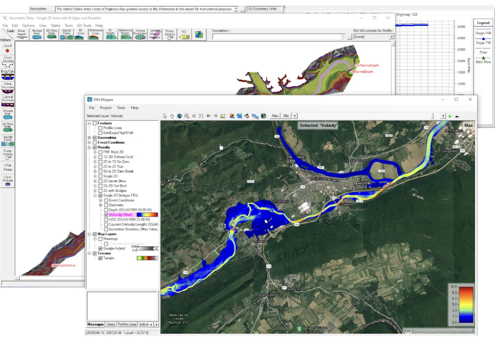
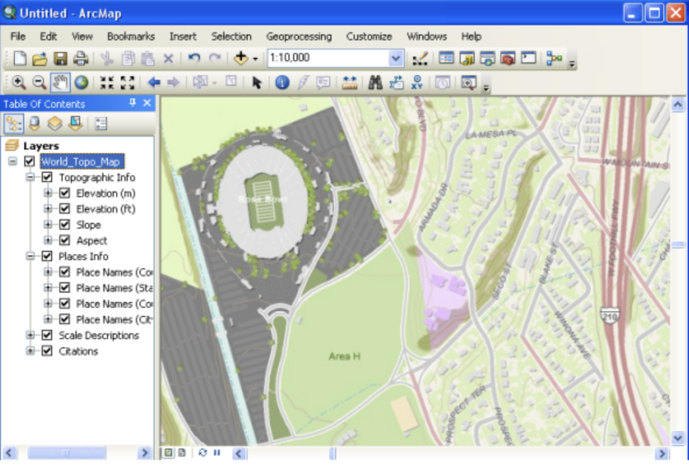
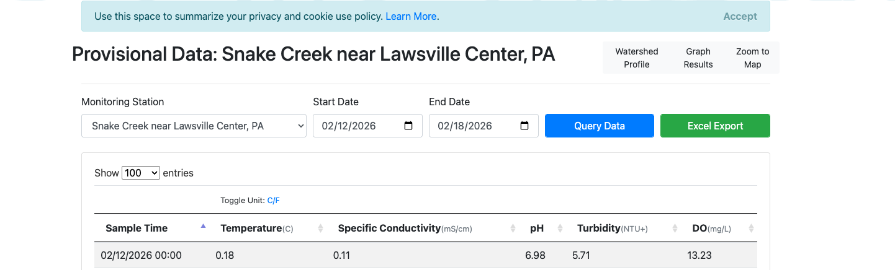

# West Virginia AMD + REE Research Mapping Project

This project documents my research and build process for mapping **acid mine drainage (AMD)** risk and **rare earth element (REE)** opportunity in West Virginia, then translating that analysis into a usable web map/dashboard for real decisions.

The goal is practical: help boots-on-the-ground teams prioritize where to test, monitor, and intervene so cleanup and recovery efforts have higher impact.

## Problem I am solving

West Virginia has legacy mining impacts that continue to affect stream chemistry. AMD lowers pH and increases dissolved metals, harming ecosystems and water usability. At the same time, AMD-impacted waters can contain REE signals that may support future recovery pathways if extraction becomes feasible.

The challenge is not just scientific; it is operational:

- field teams need a clear spatial picture of where contamination is worst
- stakeholders need transparent metrics, not black-box maps
- planners need downloadable data and simple tools, not one-off analyses

## Research approach

I designed a combined AMD-risk + REE-opportunity framework that turns chemistry and location data into interpretable map layers.

### Variables tracked at each site

- pH
- sulfate (SO4)
- iron (Fe)
- aluminum (Al)
- manganese (Mn)
- calcium (Ca)
- optional flow rate (Q)

### Normalization concept

All variables are normalized to make values comparable across different scales:

$$
\tilde{x}_i = \frac{x_i - \min(x)}{\max(x) - \min(x)}
$$

For acidity risk (where lower pH is worse):

$$
\tilde{pH}^{risk}_i = \frac{\max(pH) - pH_i}{\max(pH) - \min(pH)}
$$

### AMD severity score (conceptual model)

$$
S_i^{AMD} = 0.30\tilde{pH}^{risk}_i + 0.20\tilde{SO4}_i + 0.20\tilde{Fe}_i + 0.15\tilde{Al}_i + 0.15\tilde{Mn}_i
$$

Interpretation: higher score means stronger contamination intensity.

### Competitive cation burden

$$
C_i^{comp} = Ca_i + Fe_i + Al_i + Mn_i + K_i + Mg_i + Na_i
$$

Interpretation: higher competing ions can reduce REE extraction efficiency.

### REE opportunity score (conceptual model)

$$
S_i^{REE} = 0.45\tilde{REEsource}_i + 0.25\tilde{pH}^{extract}_i - 0.30\tilde{C}^{comp}_i
$$

Interpretation:

- REE source potential increases with sulfate/metals/acidity proxies
- extraction potential improves with higher pH conditions
- extraction potential decreases with high competing ion burden

### Spatial mapping logic

Point measurements are interpolated to create continuous surfaces and hotspot regions:

$$
\hat{S}(x) = \frac{\sum_i \frac{S_i}{d(x,x_i)^2}}{\sum_i \frac{1}{d(x,x_i)^2}}
$$

This supports watershed-level prioritization, not just site-by-site inspection.

## Research depth: methods I worked through before landing on ArcGIS

This project was not a one-tool build. I moved through multiple technical approaches to understand flow behavior, terrain context, and real water quality chemistry before converging on ArcGIS Online as the best platform for communication and deployment.

### 1) Hydraulic and floodplain modeling workflow (HEC-RAS / RAS Mapper)

I worked with HEC-RAS-style hydraulic mapping to understand flow patterns, velocity distributions, and inundation behavior in valley systems. This gave me process-level intuition for how contaminated water moves and where monitoring should be spatially concentrated.

Why this mattered:

- improved interpretation of drainage pathways and concentration zones
- helped frame where AMD chemistry is likely to intensify
- informed how watershed context layers should be presented in GIS

### 2) Cartographic and terrain-context workflow (legacy ArcMap-style practice)

I also worked through traditional map-authoring approaches (layer stacks, basemap interpretation, scale-aware cartography, and thematic overlays). This stage helped refine visual storytelling and readability before building the public-facing web product.

Why this mattered:

- made the final map easier for non-technical users to interpret
- improved symbol hierarchy for risk and opportunity overlays
- helped bridge scientific analysis and stakeholder communication

### 3) USGS provisional and station-query data workflow

Before final ArcGIS integration, I worked with USGS-style provisional station data interfaces and tabular query outputs (time windows, station-level parameter retrieval, and export-driven review). This was key for understanding the operational reality of field-measurement data quality and continuity.

Why this mattered:

- grounded the model in real parameter streams (pH, conductivity, metals proxies)
- exposed limitations of station completeness and temporal gaps
- informed the hybrid strategy (live services where possible, hosted layers where needed)

### 4) Final integration: ArcGIS Online as decision-support interface

After these stages, ArcGIS Online became the best final environment because it combines:

- spatial layers (risk + opportunity + watershed context)
- popups and dashboards for interpretation
- public sharing and export options for real collaboration

The result is a workflow that remains scientifically grounded while being usable by practitioners, local partners, and decision-makers.

## What I built

- a research-driven ArcGIS map experience for WV AMD + REE context
- hosted and/or manually managed layers for water quality points, chemistry, and watershed context
- a web page that embeds the live ArcGIS map for public-facing communication
- project documentation so methods, assumptions, and data handling are visible

## Major build challenges and how I solved them

- **ArcGIS auth complexity (org + SSO):** moved from one-shot automation to a hybrid workflow (scripted where reliable, AGOL UI where faster and more stable).
- **USGS OGC ingestion issues in AGOL:** used WQP/CSV-hosted layer workflows when direct OGC item behavior was inconsistent.
- **API/library compatibility issues:** updated scripts for newer ArcGIS API patterns and added defensive fallbacks.
- **Data availability gaps at project start:** used publicly available WV-focused water quality sources and structured placeholder/sample data to keep progress moving.

## Why this matters for real-world impact

This is not a finished production system yet, but it creates a strong decision-support foundation:

- identify potential AMD hotspots faster
- compare contamination severity across watersheds
- highlight zones where REE-related follow-up sampling is worth the effort
- make findings visible to technical and non-technical stakeholders
- keep data downloadable so partners can independently validate and act

In short: this project turns fragmented chemistry/location data into a practical spatial workflow that can better guide remediation and monitoring priorities in West Virginia.

## Broader research context

This work aligns with a growing body of evidence that mine waste and AMD streams can be both an environmental liability and a potential domestic critical-mineral resource when managed responsibly. A useful public overview is Yale E360’s reporting on REE recovery from mining waste and AMD-linked streams, including West Virginia pilot efforts and policy/monitoring caveats: [In Hunt for Rare Earths, Companies Are Scouring Mining Waste](https://e360.yale.edu/features/mining-waste-rare-earth-minerals).

## Repository contents

- `config/`: layer definitions, symbology rules, endpoint metadata
- `data/`: source and sample datasets used during build/testing
- `docs/`: project notes, data dictionary, workflow and deliverables
- `scripts/`: automation scripts for ArcGIS publishing/integration attempts
- `index.html`: public-facing site that embeds the ArcGIS map
